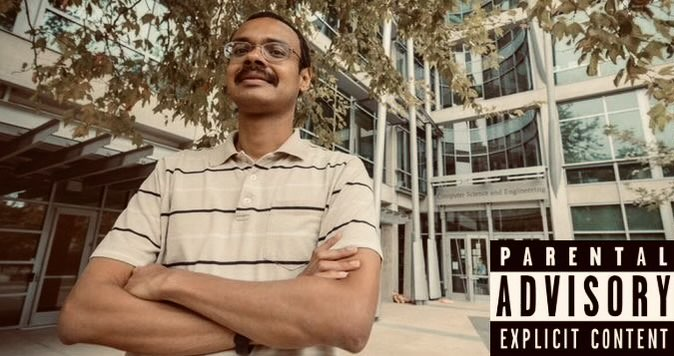

# CSE 168 Final Project: Single-Scattering Homogeneous Volumetric Scattering

### *Team Members: Simone Wright, Justin Lam*

## Introduction

When tracing rays through our scene, we typically follow the ray until it collides with an object of our scene. This is normally accurate assuming that the air is completely transparent, which is true for the most part. However, when smoke, mist, or fog enters the equation, one must consider how photons interact not only with the solid objects of the scene but also the volume of air and gas in front of the camera. In general, any volume that interacts with photons traveling through it can be called a participating medium.

As photons travel through a participating medium, these light particles often collide with the microscopic particles that make up the medium. This results in 3 key effects: in-scattering, out-scattering, and absorption. The amount of scattering is either homogeneous throughout due to consistent properties of the participating media, or it can be heterogeneous and different throughout. In our final project, we simulate these effects to produce images featuring single-scattering homogeneous volumes.

## Documentation

## Potential Improvements

Things we would add if more time: heterogeneous volumes, voxel grids, multiple scattering --> global illumination, stochastic-based/tracking, subsurface scattering

## References

https://cseweb.ucsd.edu/~viscomp/classes/cse168/sp24/lectures/168-lecture15.pdf

https://www.scratchapixel.com/lessons/3d-basic-rendering/volume-rendering-for-developers/intro-volume-rendering.html

https://graphics.pixar.com/library/ProductionVolumeRendering/paper.pdf

