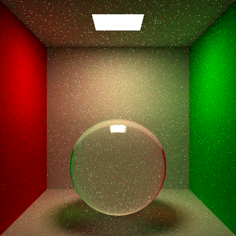
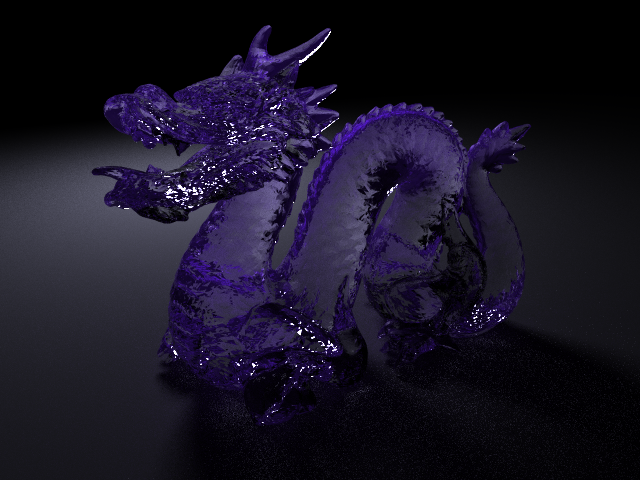
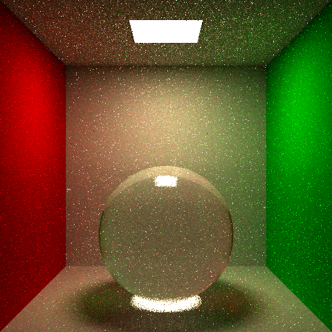
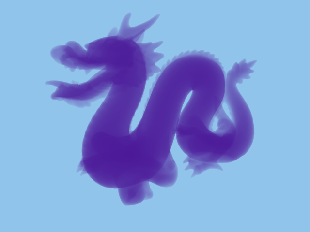
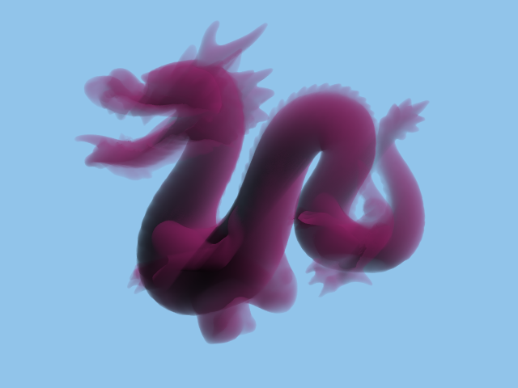
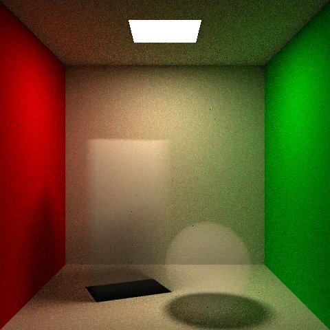
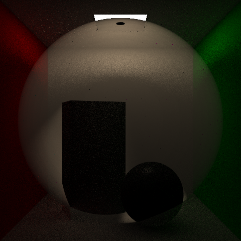
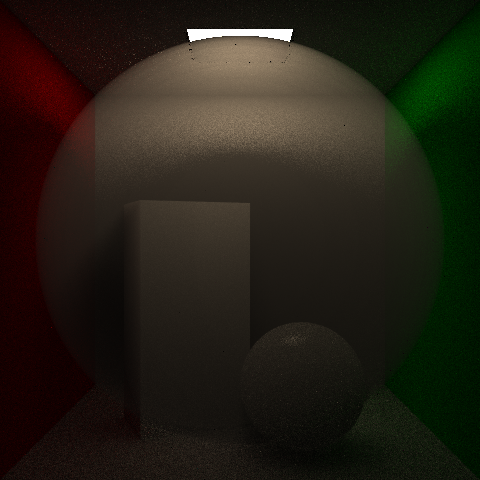
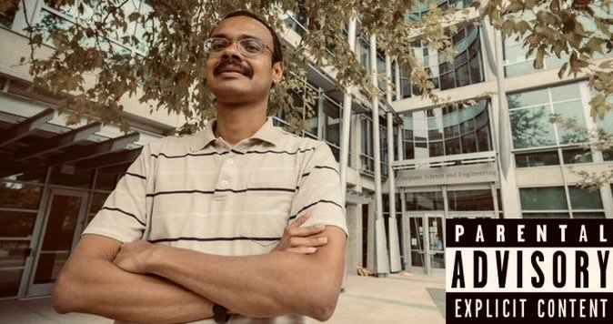

# CSE 168 Final Project: Single-Scattering Homogeneous Volumetric Scattering

### *Team Members: Simone Wright, Justin Lam*

## Introduction

When tracing rays through our scene, we typically follow the ray until it collides with an object of our scene. This is normally accurate assuming that the air is completely transparent, which is true for the most part. However, when smoke, mist, or fog enters the equation, one must consider how photons interact not only with the solid objects of the scene but also the volume of air and gas in front of the camera. In general, any volume that interacts with photons traveling through it can be called a participating medium.

As photons travel through a participating medium, these light particles often collide with the microscopic particles that make up the medium. This results in 3 key effects: in-scattering, out-scattering, and absorption. The amount of scattering is either homogeneous throughout due to consistent properties of the participating media, or it can be heterogeneous and different throughout. In our final project, we simulate these effects to produce images featuring single-scattering homogeneous volumes.

## Implementation

We first started by implmenting glass objects. Although this is not a part of the current iteration of the code, it was stated as a prerequisite to volume scattering and helped us understand how light could pass through objects and be refracted. This gave us these images:

Next, we implemented basic caustics resulting in this image:

*Notice the caustic below the sphere*

Before fully implementing homogeneous volumetric scattering, we started with just implementing absorption to simulate the attenuation of light as the photons are absorbed while crossing through the volume. We used the Beer-Lambert law and forward ray marching to make this possible. This gave the following images of the dragon:

Next, we added the scattering effects via forward ray marching. We had several issues with shadows due to the direct lighting calculation for next event estimation. We could not find much information about how to properly handle participating media in the direct lighting calculations. We eventually came up with a brute force solution that skips transmitive geometry by continuing to shoot the promary ray in the same direction until it does not intersect with anything that is not a solid.

## Documentation

The below commands are to be added to the `.test` files to enable and configure volume scattering.

Use the below command to enable volume rendering. To disable volume rendering, set it back to 0.

    volume 1

To set the absorption and scatter coefficent, utilize these commands:

    absorption r g b
    scatter r g b

To make the volume monochromatic, ensure the color channels are the same value for absorption and scatter.

## Potential Improvements

There are some mistakes we were not able to completely resolve. We struggled with nested volumes and could not finish the solution in time.

There are a multitude of additional features that we would add given more time. For example, heterogeneous volumes would allow us to model smoke and clouds and other participating media that do not have constant properties throughout. This involves an extinction coefficient that varies throughout the medium rather than being constant.

Multiple scattering would be another possible advancement to this project. Rather than have photons bounce just once through the participating medium, multiple scattering involves recursively tracing these light particles through the medium as it bounces many times. While this would take longer to run, it would result in global illumination in the volume. Some other possible improvements and features are voxel grids, tracking rather than ray marching, and subsurface scattering.

## References

https://cseweb.ucsd.edu/~viscomp/classes/cse168/sp24/lectures/168-lecture15.pdf

https://www.scratchapixel.com/lessons/3d-basic-rendering/volume-rendering-for-developers/intro-volume-rendering.html

https://graphics.pixar.com/library/ProductionVolumeRendering/paper.pdf

